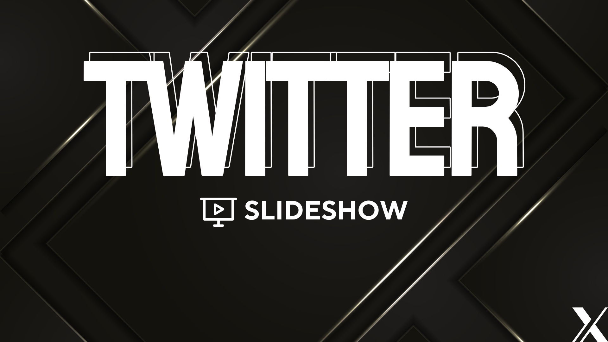
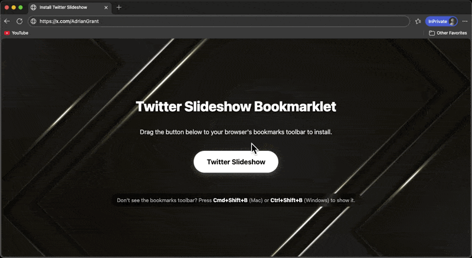

# Twitter Slideshow Bookmarklet

A browser bookmarklet that turns your Twitter (X) timeline into an immersive, full-screen media slideshow.

## Features

- **Automated Slideshow**: Automatically cycles through tweets found on your timeline.
- **Smart Scraping**: Continuously scrapes new tweets as you browse or as the slideshow progresses.
- **Auto-Scroll**: Automatically scrolls down to fetch more tweets when the slideshow reaches the end of the current list.
- **Customizable**: Adjust the slide duration (default: 10 seconds).
- **Controls**:
  - **Pause/Play**: Toggle the slideshow.
  - **Navigation**: Manually go to the previous or next slide.
  - **Keyboard Shortcuts**:
    - `ArrowRight`: Next slide
    - `ArrowLeft`: Previous slide
    - `Space`: Pause/Play
    - `Escape`: Close the slideshow

## Installation

1.  Download or open the [`install.html`](install.html) file in your browser.
2.  Drag the `Twitter Slideshow button to your bookmarks toolbar.

## Usage

1.  Navigate to [twitter.com](https://twitter.com) or [x.com](https://x.com).
2.  Click the "Twitter Slideshow" bookmark in your bookmarks toolbar
4.  The slideshow overlay will appear and start playing.
5.  Enjoy!

## Credits

Crafted by [@AdrianGrant](https://x.com/AdrianGrant)
